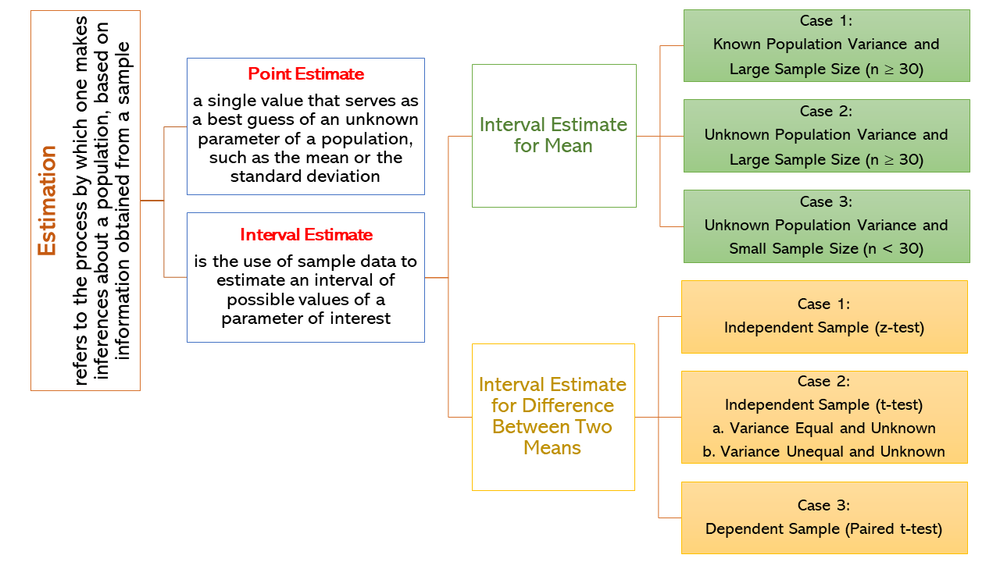

<!-- <style> -->
<!-- html { -->
<!--   scroll-behavior: smooth; -->
<!-- } -->
<!-- d-article { -->
<!--     contain: none; -->
<!--   } -->
<!-- #TOC { -->
<!--   position: fixed; -->
<!--   z-index: 50; -->
<!--   background: #ebebeb;     /* or   background: white; */ -->
<!--   padding: 10px;           /* optional */ -->
<!--   border-radius: 5px;      /* optional */ -->
<!--   } -->

<!-- /* Hide the ToC when resized to mobile or tablet:  480px, 768px, 900px */ -->
<!-- @media screen and (max-width: 900px) { -->
<!-- #TOC { -->
<!--     position: relative; -->
<!--   } -->
<!-- } -->
<!-- </style> -->

\

# Introduction\

```{r include=FALSE}
library(ggplot2)
library(tidyverse)
library(reshape2)
library(hrbrthemes)
library(kableExtra)
options(knitr.table.format = "html")
```

**Estimation** refers to the process by which one makes inferences about a population, based on information obtained from a sample. In this situation, a sample is selected from a population and data gathered from the sample will be used to estimate the parameter of a population. The relationship between estimation, estimate and estimator is that `estimation` is the process of finding an `estimate` of a parameter using an `estimator`. There are two types of estimation: *point estimate* and *interval estimate*.\

A **point estimate** in statistics is a single value that serves as a best guess of an unknown parameter of a population, such as the mean or the standard deviation. It is calculated from sample data using a point estimator, which is a function that maps the data to the point estimate. The accuracy of a point estimate is not known precisely, but it can be improved by increasing the sample size. Point estimates are often used in other statistical calculations, such as confidence intervals.\

**Interval estimation** in statistics is the use of sample data to estimate an interval of possible values of a parameter of interest. This is in contrast to point estimation, which gives a single value. Intervals are commonly chosen such that the parameter falls within with a 95 or 99 percent probability, called the confidence coefficient.\

# Interval Estimate for a Mean\

An interval estimate for a mean is an interval of values that is likely to contain the true population mean. The interval estimate for a mean is called a *confidence interval*. The interval estimate is constructed using a point estimate and a margin of error. The margin of error is calculated using the standard error of the point estimate. The common confidence level used in research are 90%, 95%, and 99%.\

## Confidence Interval for a Mean\
### Case 1: known $\sigma$ and large sample size $n\ \ge\ 30$)\

$$
\bar{X} - z_{\frac{\alpha}{2}}\ \large{(\frac{\sigma}{\sqrt{n}})}\ \lt\ \mu\ \lt\ \bar{X} + z_{\frac{\alpha}{2}}\ \large{(\frac{\sigma}{\sqrt{n}})}\ \ \ or\ \ \ \bar{X} \pm z_{\frac{\alpha}{2}}\ \large{(\frac{\sigma}{\sqrt{n}})}\
$$


## References:\


<!-- # Hello bookdown  -->

<!-- All chapters start with a first-level heading followed by your chapter title, like the line above. There should be only one first-level heading (`#`) per .Rmd file. -->

<!-- ## A section -->

<!-- All chapter sections start with a second-level (`##`) or higher heading followed by your section title, like the sections above and below here. You can have as many as you want within a chapter. -->

<!-- ### An unnumbered section {-} -->

<!-- Chapters and sections are numbered by default. To un-number a heading, add a `{.unnumbered}` or the shorter `{-}` at the end of the heading, like in this section. -->
