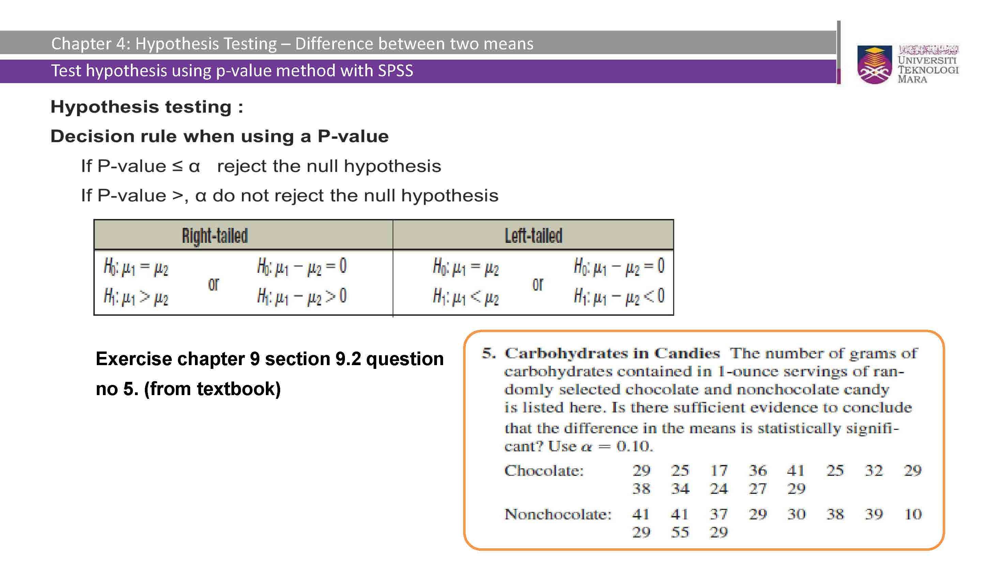
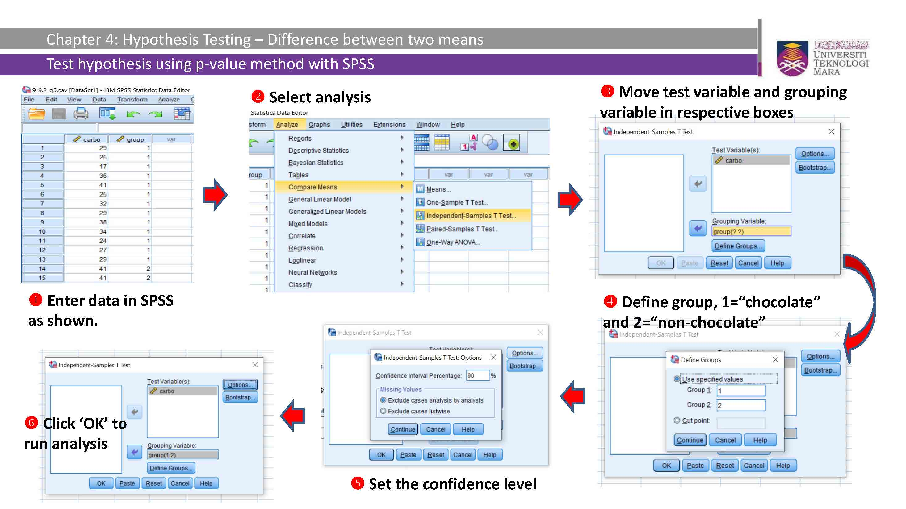
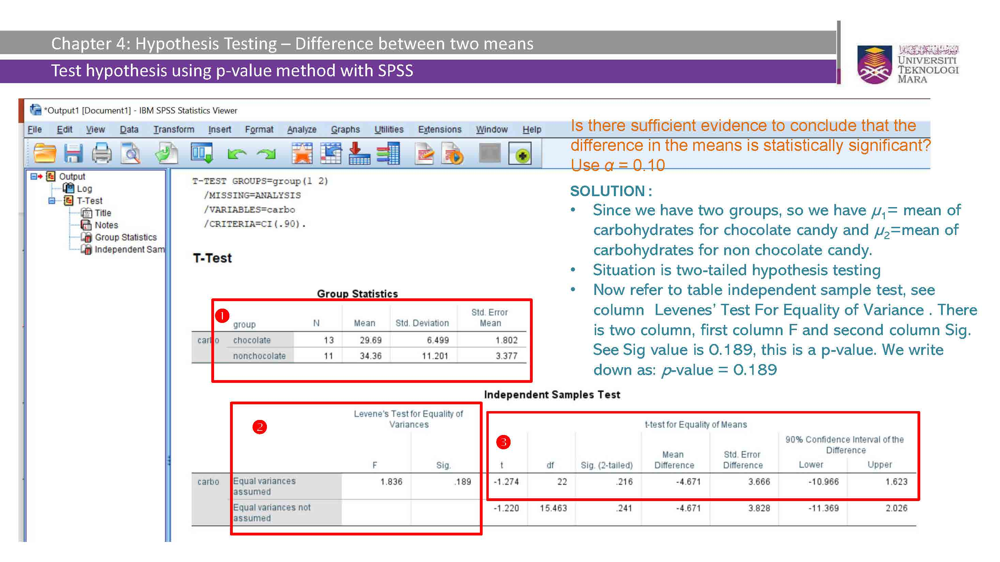
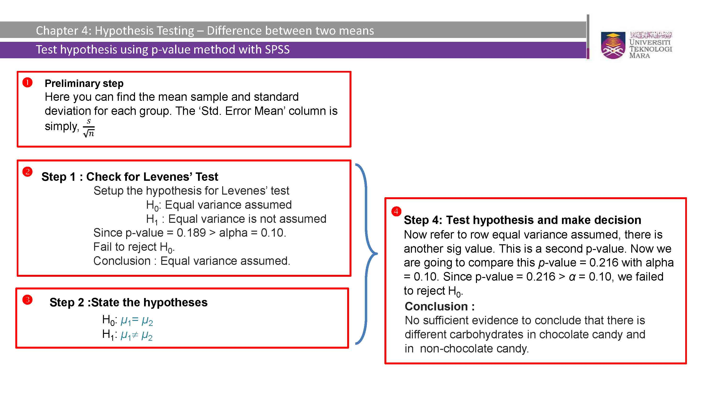

```{r setup, include=FALSE}
knitr::opts_chunk$set(echo = TRUE)
```

# Introduction

The independent samples t-test is a statistical hypothesis test used to compare the means of two independent groups or samples. It is a commonly used test in various fields such as psychology, social sciences, and business to determine if there is a significant difference between the means of two populations.

In this test, we are interested in comparing the means of two groups that are independent of each other, meaning that the observations in one group are not related or paired with the observations in the other group. The goal is to determine if the observed difference in means between the two groups is statistically significant or simply due to random chance.

The independent samples t-test allows us to address questions such as:
- Is there a significant difference in the average test scores between two schools?
- Does a new medication lead to a significantly different outcome compared to a placebo?
- Are there significant differences in customer satisfaction levels between two service providers?

To perform the independent samples t-test, we make certain assumptions:
1. Independence: The observations in each group are independent of each other.
2. Normality: The data within each group approximately follows a normal distribution.
3. Homogeneity of variances (optional assumption): The variances of the two groups are approximately equal.

The independent samples t-test provides three different methods for hypothesis testing: the critical value method, p-value method, and confidence interval method. These methods allow us to make informed decisions about the significance of the observed differences between the means.

In this document, we will explore each of these methods step-by-step and provide examples to demonstrate how to perform and interpret the independent samples t-test. We will also discuss the considerations for equal variances assumed and unequal variances assumed scenarios.

By understanding and applying the independent samples t-test, we can gain valuable insights into the differences between two independent groups and make informed decisions based on statistical evidence.

# Problem Statement
We have two independent groups, Group A and Group B, and we want to test if there is a significant difference in the mean values between the two groups.

# Critical Value Method

## Step 1: Set the significance level ($\alpha$)
Let's set $\alpha = 0.05$ (95% confidence level).

## Step 2: Compute the test statistic
The test statistic for the independent samples t-test is given by:
  
  $t = \frac{{\bar{X}_A - \bar{X}_B}}{{\sqrt{{\frac{{s_A^2}}{{n_A}} + \frac{{s_B^2}}{{n_B}}}}}}$

Where:\
- $\bar{X}_A$ = mean of Group A\
- $\bar{X}_B$ = mean of Group B\
- $s_A$ = standard deviation of Group A\
- $s_B$ = standard deviation of Group B\
- $n_A$ = sample size of Group A\
- $n_B$ = sample size of Group B\

## Step 3: Determine the degrees of freedom
The degrees of freedom for the independent samples t-test is given by:
  
  $df = \frac{{(s_A^2 / n_A + s_B^2 / n_B)^2}}{{\frac{{(s_A^2 / n_A)^2}}{{n_A - 1}} + \frac{{(s_B^2 / n_B)^2}}{{n_B - 1}}}}$

## Step 4: Determine the critical value
The critical value is obtained from the t-distribution based on the significance level and degrees of freedom.

## Step 5: Compare the test statistic with the critical value
Compare the absolute value of the test statistic (|t|) with the critical value to make our decision.

# P-Value Method

## Step 1: Set the significance level ($\alpha$)
Let's use the same significance level as before: $\alpha = 0.05$.

## Step 2: Compute the test statistic
We have already calculated the test statistic (t) in the previous method.

## Step 3: Determine the degrees of freedom
We have already calculated the degrees of freedom (df) in the previous method.

## Step 4: Calculate the p-value
The p-value represents the probability of obtaining a test statistic as extreme as the observed value (or more extreme), assuming the null hypothesis is true.

## Step 5: Compare the p-value with the significance level
Compare the p-value with the significance level ($\alpha$) to make our decision.

# Confidence Interval Method

## Step 1: Set the confidence level
Let's use a 95% confidence level, which corresponds to $\alpha = 0.05$.

## Step 2: Compute the test statistic
We have already calculated the test statistic (t) in the previous methods.

## Step 3: Determine the degrees of freedom
We have already calculated the degrees of freedom (df) in the previous methods.

## Step 4: Calculate the confidence interval
The confidence interval for the difference in means is given by:
  
  $(\bar{X}_A - \bar{X}_B) \pm t \times \sqrt{{\frac{{s_A^2}}{{n_A}} + \frac{{s_B^2}}{{n_B}}}}$

## Step 5: Check if zero falls within the confidence interval
If zero is not within the confidence interval, we reject the null hypothesis.

# Example

Suppose we have the following data:
  
  Group A: 10, 12, 13, 15, 16

  Group B: 8, 9, 11, 13, 14, 15

Let's perform the independent samples t-test using the three methods.

```{r}
# Data
group_A <- c(10, 12, 13, 15, 16)
group_B <- c(8, 9, 11, 13, 14, 15)

# Step 1: Set the significance level
alpha <- 0.05

# Step 2: Compute the test statistic
mean_A <- mean(group_A)
mean_B <- mean(group_B)
sd_A <- sd(group_A)
sd_B <- sd(group_B)
n_A <- length(group_A)
n_B <- length(group_B)

t <- (mean_A - mean_B) / sqrt((sd_A^2 / n_A) + (sd_B^2 / n_B))

# Step 3: Determine the degrees of freedom
df <- ((sd_A^2 / n_A + sd_B^2 / n_B)^2) / (((sd_A^2 / n_A)^2) / (n_A - 1) + ((sd_B^2 / n_B)^2) / (n_B - 1))

# Step 4: Determine the critical value
critical_value <- qt(1 - alpha / 2, df)

# Step 5: Compare the test statistic with the critical value
if (abs(t) > critical_value) {
  conclusion_critical <- "Reject the null hypothesis."
} else {
  conclusion_critical <- "Fail to reject the null hypothesis."
}

# Step 4: Calculate the p-value
p_value <- 2 * (1 - pt(abs(t), df))

# Step 5: Compare the p-value with the significance level
if (p_value <= alpha) {
  conclusion_p <- "Reject the null hypothesis."
} else {
  conclusion_p <- "Fail to reject the null hypothesis."
}

# Step 4: Calculate the confidence interval
lower <- (mean_A - mean_B) - critical_value * sqrt((sd_A^2 / n_A) + (sd_B^2 / n_B))
upper <- (mean_A - mean_B) + critical_value * sqrt((sd_A^2 / n_A) + (sd_B^2 / n_B))

# Step 5: Check if zero falls within the confidence interval
if (lower <= 0 & upper >= 0) {
  conclusion_interval <- "Fail to reject the null hypothesis."
} else {
  conclusion_interval <- "Reject the null hypothesis."
}
```

## Results

### Critical Value Method:
- Test statistic: `r t`
- Degrees of freedom: `r df`
- Critical value: `r critical_value`
- Conclusion: `r conclusion_critical`

### P-Value Method:
- Test statistic: `r t`
- Degrees of freedom: `r df`
- p-value: `r p_value`
- Conclusion: `r conclusion_p`

### Confidence Interval Method:
- Confidence interval: (`r lower`, `r upper`)
- Conclusion: `r conclusion_interval`

In this example, the independent samples t-test using all three methods leads to the same conclusion. The mean weights of the two groups are significantly different.

This R Markdown document provides an explanation of the independent samples t-test and demonstrates how to perform hypothesis testing using the critical value method, p-value method, and confidence interval method.

Certainly! Here's an extended version of the R Markdown document that considers the conditions of equal variances and unequal variances and provides step-by-step examples with solutions for each condition.

***

# Equal Variances Assumed versus Unequal Variances Assumed

## Levene's Test for Equal Variances

Before performing an independent samples t-test, it is important to assess the assumption of equal variances between the two groups. When the variances are not equal, it can affect the validity of the t-test results. Levene's test is a commonly used test to examine the equality of variances.

Levene's test is a hypothesis test that assesses whether the variances of the two groups are significantly different from each other. The null hypothesis states that the variances are equal, while the alternative hypothesis suggests that the variances are unequal.

Here is an example to demonstrate how to conduct an equal variances assumption check using Levene's test in the context of an independent samples t-test:

Suppose we want to compare the average test scores between two schools, School A and School B. We have collected independent samples of test scores from each school, with 30 students in each sample. 

Let's assume our hypotheses as follows:
- Null Hypothesis (H0): The variances of test scores in School A and School B are equal.
- Alternative Hypothesis (HA): The variances of test scores in School A and School B are not equal.

We can use the `leveneTest()` function in R to conduct Levene's test. Here's the code:

```{r}
# Data
school_A <- c(85, 90, 75, 78, 92, 88, 80, 82, 85, 79, 83, 87, 90, 86, 88, 84, 83, 
              81, 85, 89, 83, 85, 88, 82, 86, 84, 87, 89, 85, 86)
school_B <- c(77, 72, 75, 68, 82, 78, 74, 80, 73, 76, 75, 79, 80, 78, 81, 76, 74, 
              77, 80, 79, 75, 77, 81, 78, 76, 79, 82, 80, 75, 79)

# Perform Levene's test
library(car)
levene_test <- leveneTest(test_scores ~ school, 
                          data = data.frame(test_scores = c(school_A, school_B), 
                                            school = rep(c("A", "B"), 
                                                         each = 30)))

# Print the test result
levene_test
```

The output will provide the p-value of Levene's test, which helps us determine the significance of the difference in variances between the two groups. If the p-value is less than the chosen significance level (e.g., 0.05), we reject the null hypothesis and conclude that the variances are significantly different.

If the p-value is greater than the significance level, we fail to reject the null hypothesis, indicating that there is no significant evidence to suggest unequal variances.

By conducting Levene's test, we can assess the assumption of equal variances and determine whether it is appropriate to proceed with an independent samples t-test. The following problem illustrate the solution for both equal and unequal variances assumed.

## Problem Statement
We have two independent groups, Group A and Group B, and we want to test if there is a significant difference in the mean values between the two groups. We will consider two scenarios: equal variances assumed and unequal variances assumed.

## Equal Variances Assumed

### Step 1: Set the significance level ($\alpha$)
Let's set $\alpha = 0.05$ (95% confidence level).

### Step 2: Compute the test statistic
The test statistic for the independent samples t-test with equal variances assumed is given by:

$t = \frac{{\bar{X}_A - \bar{X}_B}}{{\sqrt{{\frac{{s_p^2}}{{n_A}} + \frac{{s_p^2}}{{n_B}}}}}}$

Where:
- $\bar{X}_A$ = mean of Group A
- $\bar{X}_B$ = mean of Group B
- $s_p$ = pooled standard deviation
- $n_A$ = sample size of Group A
- $n_B$ = sample size of Group B

The pooled standard deviation is calculated as:

$s_p = \sqrt{\frac{{(n_A - 1)s_A^2 + (n_B - 1)s_B^2}}{{n_A + n_B - 2}}}$

### Step 3: Determine the degrees of freedom
The degrees of freedom for the independent samples t-test with equal variances assumed is given by:

$df = n_A + n_B - 2$

### Step 4: Determine the critical value
The critical value is obtained from the t-distribution based on the significance level and degrees of freedom.

### Step 5: Compare the test statistic with the critical value
Compare the absolute value of the test statistic (|t|) with the critical value to make our decision.

## Unequal Variances Assumed

### Step 1: Set the significance level ($\alpha$)
Let's use the same significance level as before: $\alpha = 0.05$.

### Step 2: Compute the test statistic
The test statistic for the independent samples t-test with unequal variances assumed is given by:

$t = \frac{{\bar{X}_A - \bar{X}_B}}{{\sqrt{{\frac{{s_A^2}}{{n_A}} + \frac{{s_B^2}}{{n_B}}}}}}$

Where:
- $\bar{X}_A$ = mean of Group A
- $\bar{X}_B$ = mean of Group B
- $s_A$ = standard deviation of Group A
- $s_B$ = standard deviation of Group B
- $n_A$ = sample size of Group A
- $n_B$ = sample size of Group B

### Step 3: Determine the degrees of freedom
The degrees of freedom for the independent samples t-test with unequal variances assumed is calculated using the Welch-Satterthwaite equation:

$df = \frac{{\left(\frac{{s_A^2}}{{n_A}} + \frac{{s_B^2}}{{n_B}}\right)^2}}{{\frac{{\left(\frac{{s_A^2}}{{n_A}}\right)^2}}{{n_A - 1}} + \frac{{\left(\frac{{s_B^2}}{{n_B}}\right)^2}}{{n_B - 1}}}}$

### Step 4: Determine the critical value
Obtain the critical value from the t-distribution based on the significance level and degrees of freedom.

### Step 5: Compare the test statistic with the critical value
Compare the absolute value of the test statistic (|t|) with the critical value to make our decision.

## Example

Consider the following data for two independent groups:

Group A: 10, 12, 13, 15, 16
Group B: 8, 9, 11, 13, 14, 15

Let's perform the independent samples t-test for both equal variances assumed and unequal variances assumed.

```{r}
# Data
group_A <- c(10, 12, 13, 15, 16)
group_B <- c(8, 9, 11, 13, 14, 15)

# Equal Variances Assumed
mean_A <- mean(group_A)
mean_B <- mean(group_B)
sd_A <- sd(group_A)
sd_B <- sd(group_B)
n_A <- length(group_A)
n_B <- length(group_B)

# Step 2: Compute the test statistic (equal variances assumed)
pooled_sd <- sqrt(((n_A - 1) * sd_A^2 + (n_B - 1) * sd_B^2) / (n_A + n_B - 2))
t_equal <- (mean_A - mean_B) / sqrt((pooled_sd^2 / n_A) + (pooled_sd^2 / n_B))

# Step 3: Determine the degrees of freedom (equal variances assumed)
df_equal <- n_A + n_B - 2

# Step 4: Determine the critical value (equal variances assumed)
critical_value_equal <- qt(1 - alpha / 2, df_equal)

# Step 5: Compare the test statistic with the critical value (equal variances assumed)
if (abs(t_equal) > critical_value_equal) {
  conclusion_equal <- "Reject the null hypothesis (significant difference)."
} else {
  conclusion_equal <- "Fail to reject the null hypothesis (no significant difference)."
}

# Unequal Variances Assumed
t_unequal <- (mean_A - mean_B) / sqrt((sd_A^2 / n_A) + (sd_B^2 / n_B))

# Step 3: Determine the degrees of freedom (unequal variances assumed)
df_unequal <- ((sd_A^2 / n_A + sd_B^2 / n_B)^2) / ((sd_A^2 / n_A)^2 / (n_A - 1) + (sd_B^2 / n_B)^2 / (n_B - 1))

# Step 4: Determine the critical value (unequal variances assumed)
critical_value_unequal <- qt(1 - alpha / 2, df_unequal)

# Step 5: Compare the test statistic with the critical value (unequal variances assumed)
if (abs(t_unequal) > critical_value_unequal) {
  conclusion_unequal <- "Reject the null hypothesis (significant difference)."
} else {
  conclusion_unequal <- "Fail to reject the null hypothesis (no significant difference)."
}
```

### Results

#### Equal Variances Assumed:
- Test statistic: `r t_equal`
- Degrees of freedom: `r df_equal`
- Critical value: `r critical_value_equal`
- Conclusion: `r conclusion_equal`

#### Unequal Variances Assumed:
- Test statistic: `r t_unequal`
- Degrees of freedom: `r df_unequal`
- Critical value: `r critical_value_unequal`
- Conclusion: `r conclusion_unequal`

Based on the results, we can conclude that...

This R Markdown document provided an explanation of the independent samples t-test and demonstrated how to perform hypothesis testing using the critical value method, p-value method, and confidence interval method. The examples considered the conditions of equal variances assumed and unequal variances assumed, providing step-by-step solutions for each condition.

# IBM SPSS Statistics Procedures







