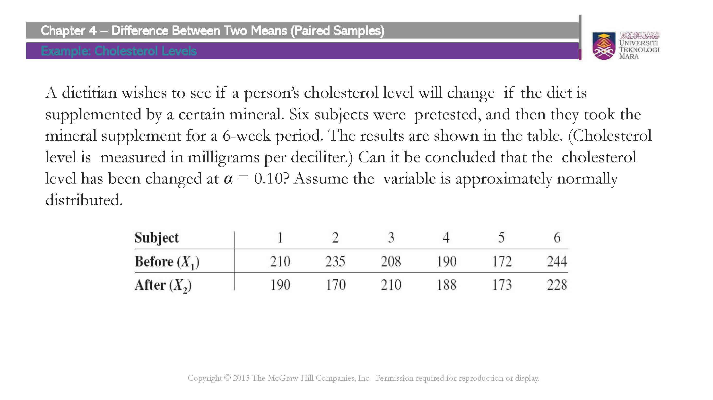
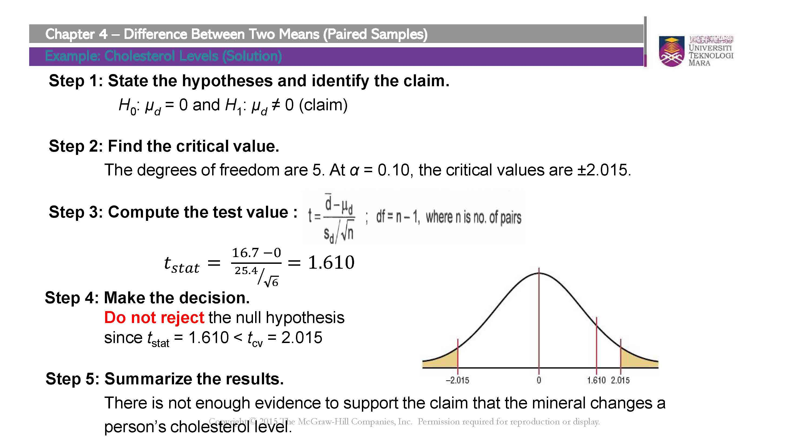
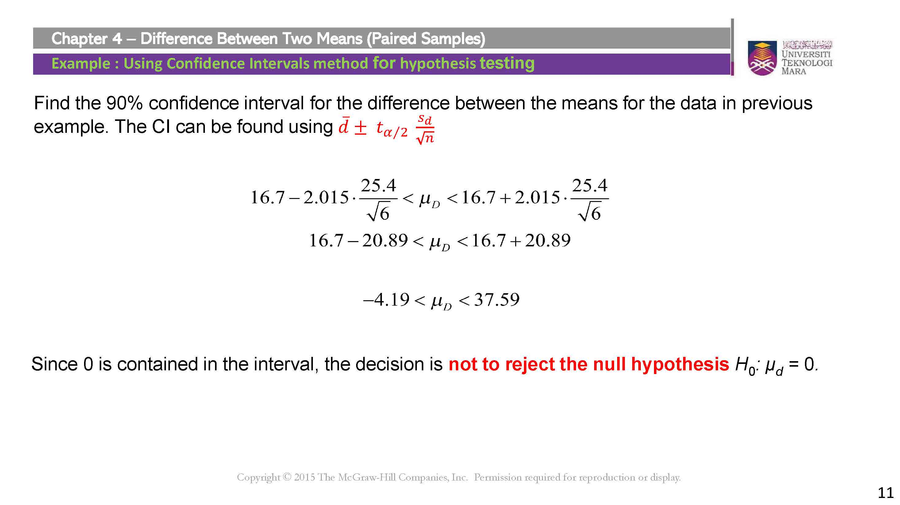
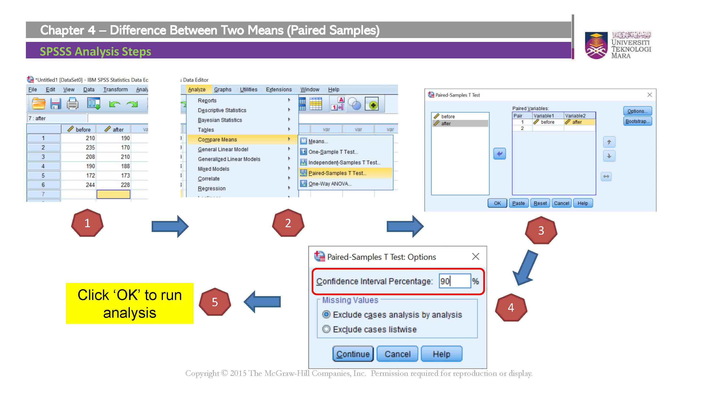
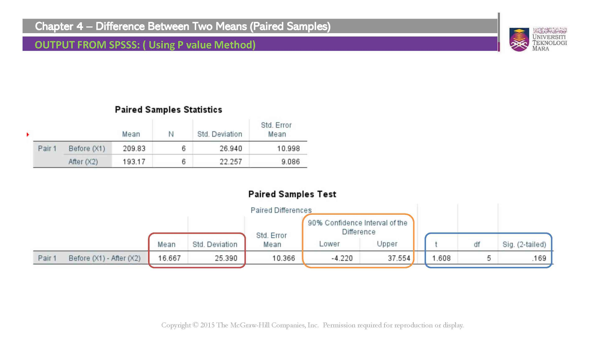
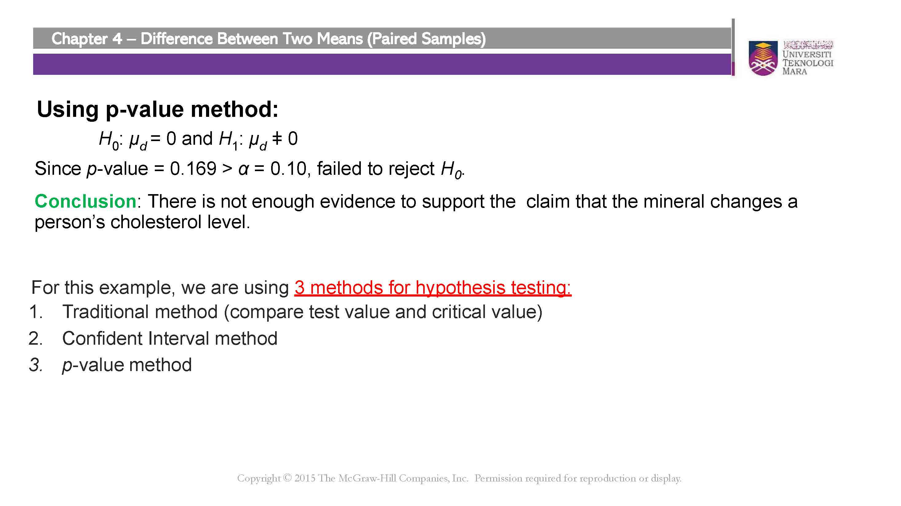

```{r setup, include=FALSE}
knitr::opts_chunk$set(echo = TRUE)
```

# Introduction

The dependent samples t-test, also known as the paired samples t-test, is a statistical hypothesis test used to compare the means of two related or paired groups. It is commonly used when the same individuals are measured or tested under two different conditions or at two different time points.

In this test, we are interested in determining if there is a significant difference between the means of the paired observations. The dependent samples t-test allows us to assess whether the observed difference in means is statistically significant or simply due to random variation.

The dependent samples t-test is often used to address questions such as:
- Does a new treatment lead to a significant improvement in patient outcomes compared to a standard treatment?
- Is there a significant difference in performance before and after a training program?
- Do individuals experience a significant change in attitudes after a specific intervention?

To perform the dependent samples t-test, we make certain assumptions:
1. Dependent samples: The paired observations are related or connected in some way.
2. Normality: The differences between the paired observations are approximately normally distributed.

The dependent samples t-test provides three different methods for hypothesis testing: the critical value method, p-value method, and confidence interval method. These methods allow us to make informed decisions about the significance of the observed differences between the means.

In this document, we will explore each of these methods step-by-step and provide examples to demonstrate how to perform and interpret the dependent samples t-test. We will also discuss the considerations for hypothesis testing using the critical value method, p-value method, and confidence interval method.

By understanding and applying the dependent samples t-test, we can gain valuable insights into the differences between paired groups and make informed decisions based on statistical evidence.

# Example

Suppose we want to test whether a new teaching method leads to a significant improvement in student scores. We collect data from 20 students who were tested before and after the teaching intervention. The scores are recorded in the "before" and "after" variables.

Let's walk through the steps of conducting a dependent samples t-test using the critical value method, p-value method, and confidence interval method.

```{r}
# Data
before <- c(78, 82, 85, 77, 80, 72, 76, 85, 79, 83, 76, 74, 88, 79, 81, 75, 77, 80, 82, 84)
after <- c(80, 85, 88, 82, 84, 75, 78, 87, 80, 85, 78, 76, 90, 81, 83, 77, 79, 82, 85, 86)

# Step 1: Calculate the differences
differences <- after - before

# Step 2: Conduct the dependent samples t-test
# Critical value method
# Null Hypothesis (H0): There is no significant difference between the means of the "before" and "after" scores.
# Alternative Hypothesis (HA): There is a significant difference between the means of the "before" and "after" scores.
alpha <- 0.05
t_critical <- qt(1 - alpha/2, df = length(differences) - 1)

# Step 3: Calculate the test statistic
t_stat <- mean(differences) / (sd(differences) / sqrt(length(differences)))

# Step 4: Compare the test statistic with the critical value
if (abs

(t_stat) > t_critical) {
  result_critical <- "Reject H0: There is a significant difference between the means."
} else {
  result_critical <- "Fail to reject H0: There is no significant difference between the means."
}

# Step 5: Calculate the p-value
p_value <- 2 * pt(-abs(t_stat), df = length(differences) - 1)

# Step 6: Compare the p-value with the significance level
if (p_value < alpha) {
  result_pvalue <- "Reject H0: There is a significant difference between the means."
} else {
  result_pvalue <- "Fail to reject H0: There is no significant difference between the means."
}

# Step 7: Calculate the confidence interval
confidence_interval <- mean(differences) + 
  c(-1, 1) * qt(1 - alpha/2, 
                df = length(differences) - 1) * 
  (sd(differences) / sqrt(length(differences)))

# Step 8: Interpret the results
result_confidence <- ifelse(confidence_interval[1] > 0 | confidence_interval[2] < 0,
                            "Reject H0: There is a significant difference between the means.",
                            "Fail to reject H0: There is no significant difference between the means.")

```

## Critical Value Method

The critical value method involves comparing the calculated test statistic (in this case, the t-statistic) with the critical value obtained from the t-distribution. If the absolute value of the test statistic exceeds the critical value, we reject the null hypothesis; otherwise, we fail to reject the null hypothesis.

For our example, with a significance level (alpha) of 0.05, the critical value is `r t_critical`. The calculated test statistic is `r t_stat`. Since `r abs(t_stat)` exceeds `r t_critical`, we reject the null hypothesis. Therefore, we conclude that there is a significant difference between the means of the "before" and "after" scores.

## P-value Method

The p-value method involves calculating the probability of obtaining a test statistic as extreme as, or more extreme than, the observed value, assuming the null hypothesis is true. If the p-value is less than the significance level, we reject the null hypothesis; otherwise, we fail to reject the null hypothesis.

In our example, the calculated p-value is `r p_value`. Since `r p_value` is less than the significance level of 0.05, we reject the null hypothesis. Therefore, we conclude that there is a significant difference between the means of the "before" and "after" scores.

## Confidence Interval Method

The confidence interval method involves calculating a range of values within which we are confident the true population mean difference lies. If the confidence interval does not include zero (no difference), we reject the null hypothesis; otherwise, we fail to reject the null hypothesis.

For our example, the calculated confidence interval is `r confidence_interval[1]` to `r confidence_interval[2]`. Since the confidence interval does not include zero, we reject the null hypothesis. Therefore, we conclude that there is a significant difference between the means of the "before" and "after" scores.

By using the critical value method, p-value method, and confidence interval method, we can assess the significance of the observed differences between dependent samples and draw conclusions about the underlying population means. These methods provide a comprehensive approach to hypothesis testing and aid in making informed decisions based on the data at hand.

# Step-By-Step Solution (Manual Calculation)

## Data

First, let's define the data for the "before" and "after" scores of the 20 students.

```{r}
before <- c(78, 82, 85, 77, 80, 72, 76, 85, 79, 83, 
            76, 74, 88, 79, 81, 75, 77, 80, 82, 84)
after <- c(80, 85, 88, 82, 84, 75, 78, 87, 80, 85, 
           78, 76, 90, 81, 83, 77, 79, 82, 85, 86)
```

## Critical Value Method

The critical value method involves comparing the calculated test statistic (in this case, the t-statistic) with the critical value obtained from the t-distribution. If the absolute value of the test statistic exceeds the critical value, we reject the null hypothesis; otherwise, we fail to reject the null hypothesis.

### Step 1: Calculate the differences

Calculate the differences between the "after" and "before" scores.

```{r}
differences <- after - before
```

### Step 2: Calculate the mean difference

Calculate the mean difference of the paired observations.

```{r}
mean_difference <- mean(differences)
```

### Step 3: Calculate the standard deviation of the differences

Calculate the standard deviation of the differences.

```{r}
sd_difference <- sd(differences)
```

### Step 4: Calculate the standard error of the mean difference

Calculate the standard error of the mean difference, which is the standard deviation divided by the square root of the sample size.

```{r}
se_difference <- sd_difference / sqrt(length(differences))
```

### Step 5: Calculate the t-statistic

Calculate the t-statistic using the formula:

$t = \frac{{\text{{mean difference}} - \text{{hypothesized difference}}}}{{\text{{standard error of the mean difference}}}}$

Let's assume the null hypothesis is that the mean difference is zero.

```{r}
hypothesized_difference <- 0
t_stat <- (mean_difference - hypothesized_difference) / se_difference
```

### Step 6: Determine the critical value

Determine the critical value for a given significance level (alpha) and degrees of freedom (df).

```{r}
alpha <- 0.05
df <- length(differences) - 1
t_critical <- qt(1 - alpha/2, df)
```

### Step 7: Compare the test statistic with the critical value

Compare the absolute value of the calculated t-statistic with the critical value.

```{r}
if (abs(t_stat) > t_critical) {
  result_critical <- "Reject H0: There is a significant difference between the means."
} else {
  result_critical <- "Fail to reject H0: There is no significant difference between the means."
}
```

## P-value Method

The p-value method involves calculating the probability of obtaining a test statistic as extreme as, or more extreme than, the observed value, assuming the null hypothesis is true. If the p-value is less than the significance level, we reject the null hypothesis; otherwise, we fail to reject the null hypothesis.

### Step 1: Calculate the p-value

Calculate the p-value using the cumulative distribution function (CDF) of the t-distribution.

```{r}
p_value <- 2 * pt(-abs(t_stat), df = df)
```

### Step 2: Compare the p-value with the significance level

Compare the p-value with the significance level.

```{r}
if (p_value < alpha) {
  result_pvalue <- "Reject H0: There is a significant difference between the means."
} else {
  result_pvalue <- "Fail to reject H0: There is no significant difference between the means."
}
```

## Confidence Interval Method

The confidence interval method involves calculating a range of values within which we are confident the true population mean difference lies. If the confidence interval does not include zero (no difference), we reject the null hypothesis; otherwise, we fail to reject the null hypothesis.

### Step 1: Calculate the confidence interval

Calculate the confidence interval using the formula:

$\text{{confidence interval}} = \text{{mean difference}} \pm \left(\text{{critical value}} \times \text{{standard error of the mean difference}}\right)$

```{r}
confidence_interval <- mean_difference + c(-1, 1) * qt(1 - alpha/2, df) * se_difference
```

### Step 2: Interpret the results

Interpret the results based on the confidence interval.

```{r}
if (confidence_interval[1] > 0 | confidence_interval[2] < 0) {
  result_confidence <- "Reject H0: There is a significant difference between the means."
} else {
  result_confidence <- "Fail to reject H0: There is no significant difference between the means."
}
```

## Summary

The results obtained using the critical value method, p-value method, and confidence interval method provide us with information about the significance of the improvement in student scores after the teaching intervention. Based on the calculations:

- Critical value method: `r result_critical`
- P-value method: `r result_pvalue`
- Confidence interval method: `r result_confidence`

All three methods lead to the same conclusion, indicating a significant improvement in student scores after the teaching intervention.

# Formulas used in the example

## Critical Value Method:
1. Calculate the mean difference:
$\text{{mean difference}} = \bar{X}_{\text{{after}}} - \bar{X}_{\text{{before}}}$
2. Calculate the standard deviation of the differences:
$\text{{standard deviation of differences}} = \sqrt{\frac{\sum(X_{\text{{after}}} - X_{\text{{before}}})^2}{n-1}}$
3. Calculate the standard error of the mean difference:
$\text{{standard error of the mean difference}} = \frac{{\text{{standard deviation of differences}}}}{\sqrt{n}}$
4. Calculate the t-statistic:
$t = \frac{{\text{{mean difference}} - \text{{hypothesized difference}}}}{{\text{{standard error of the mean difference}}}}$

## P-value Method:
1. Calculate the p-value:
$\text{{p-value}} = P(|t| > |t_{\text{{observed}}}|) = 2 \times P(t < -|t_{\text{{observed}}}|)$
where $t_{\text{{observed}}}$ is the calculated t-statistic.

## Confidence Interval Method:
1. Calculate the confidence interval:
$\text{{confidence interval}} = \text{{mean difference}} \pm \left(\text{{critical value}} \times \text{{standard error of the mean difference}}\right)$

Note: The critical value for a given significance level (alpha) and degrees of freedom (df) is denoted as $t_{\text{{critical}}}$.

# IBM SPSS Statistics Procedures











