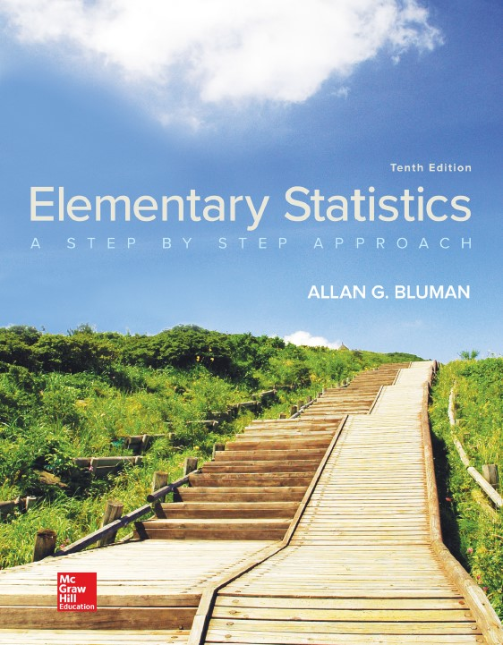

```{r setup, include=FALSE}
knitr::opts_chunk$set(echo = FALSE)

# Learn more about creating websites with Distill at:
# https://rstudio.github.io/distill/website.html

```

<!-- <center>{width="50%"}</center> -->

Hi! [👋]{.wave} Welcome to the Statistics for Business & Social Sciences course website. You can find all information related to the course on this site. I wish all of you good luck & all the best going through this course. I hope you enjoy it!
