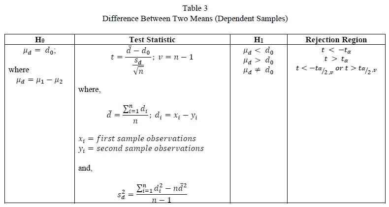

```{r setup, include=FALSE}
knitr::opts_chunk$set(echo = FALSE)
library(slickR)
```

## Weekly Scheme of Work  

<embed src="files//Scheme of Work 20224.pdf" type="application/pdf" width="100%" height="500px" />

If you can't view the pdf file, click on the file's link - <a href="files//Scheme of Work 20224.pdf"> Download PDF!</a>  

<!-- ### Session 20214   -->

<!-- ```{r} -->
<!-- slickR::slickR( -->
<!--     list.files("./images/sow/",full.names = TRUE,pattern = 'jpg'), -->
<!--     height = 700, -->
<!--     width = '95%') -->
<!-- ```   -->

<!-- <aside> -->
<!-- [Download - Scheme of Work](./files/Scheme of Work 20224.pdf) -->
<!-- </aside> -->

***  

## Presentations Slides  

### Chapter 1 - Introduction to Statistics\  

<details><summary>Show Slide Contents</summary>
<center>
<embed src="files/slides/Unit 1 Introduction to Statistics.pdf" type="application/pdf" width="100%" height="500px" />
<p>
If you can't view the pdf file, click on the file's link - <a href="files/slides/Unit 1 Introduction to Statistics.pdf"> Download PDF!</a>
</p>
</center>
</details>

<!-- ```{r} -->
<!-- slickR::slickR( -->
<!--     list.files("./files/slides/Unit 1 Introduction to Statistics/",full.names = TRUE,pattern = 'jpg'), -->
<!--     height = 400, -->
<!--     width = '95%') -->
<!-- ```   -->

<!-- <aside> -->
<!-- [Download - Unit 1 Introduction to Statistics](./files/slides/Unit 1 Introduction to Statistics.pdf) -->
<!-- </aside> -->

***  

### Chapter 2  

Under constructions  

***  

### Chapter 3 - Estimations  

#### Confidence Interval Estimation  

<details><summary>Show Slide Contents</summary>
<center>
<embed src="files/slides/Unit 3 - Estimations - Confidence Interval Estimation.pdf" type="application/pdf" width="100%" height="500px" />
<p>
If you can't view the pdf file, click on the file's link - <a href="files/slides/Unit 3 - Estimations - Confidence Interval Estimation.pdf"> Download PDF!</a>
</p>
</center>
</details>

<!-- ```{r} -->
<!-- slickR::slickR( -->
<!--     list.files("./files/slides/Unit 3 Estimation 1/",full.names = TRUE,pattern = 'jpg'), -->
<!--     height = 400, -->
<!--     width = '95%') -->
<!-- ```   -->

<!-- <aside> -->
<!-- [Download - Unit 3 - Estimations - Confidence Interval Estimation](./files/slides/Unit 3 - Estimations - Confidence Interval Estimation.pdf) -->
<!-- </aside> -->

***  

#### Sampling Distributions  

<details><summary>Show Slide Contents</summary>
<center>
<embed src="files/slides/Unit 3 - Estimations - Sampling Distributions.pdf" type="application/pdf" width="100%" height="500px" />
<p>
If you can't view the pdf file, click on the file's link - <a href="files/slides/Unit 3 - Estimations - Sampling Distributions.pdf"> Download PDF!</a>
</p>
</center>
</details>

<!-- ```{r} -->
<!-- slickR::slickR( -->
<!--     list.files("./files/slides/Unit 3 Estimation 2/",full.names = TRUE,pattern = 'jpg'), -->
<!--     height = 400, -->
<!--     width = '95%') -->
<!-- ``` -->

<!-- <aside> -->
<!-- [Download - Unit 3 - Estimations - Sampling Distributions](./files/slides/Unit 3 - Estimations - Sampling Distributions.pdf) -->
<!-- </aside> -->

***  

### Chapter 4 - Hypothesis Testing  

#### One Sample Test  

<details><summary>Show Slide Contents</summary>
<center>
<embed src="files/slides/Unit 4 - Hypothesis Testing 1.pdf" type="application/pdf" width="100%" height="500px" />
<p>
If you can't view the pdf file, click on the file's link - <a href="files/slides/Unit 4 - Hypothesis Testing 1.pdf"> Download PDF!</a>
</p>
</center>
</details>

<!-- ```{r} -->
<!-- slickR::slickR( -->
<!--     list.files("./files/slides/Chapter 4 Hypothesis Testing 1/",full.names = TRUE,pattern = 'jpg'), -->
<!--     height = 400, -->
<!--     width = '95%') -->
<!-- ``` -->

<center>

</center>

<!-- <aside> -->
<!-- [Download - Chapter 4 HYPOTHESIS TESTING 1](./files/slides/Unit 4 - Hypothesis Testing 1.pdf) -->
<!-- </aside> -->

***  

#### Difference Between Two Means  

<details><summary>Show Slide Contents</summary>
<center>
<embed src="files/slides/Chapter 4 HYPOTHESIS TESTING 2.pdf" type="application/pdf" width="100%" height="500px" />
<p>
If you can't view the pdf file, click on the file's link - <a href="files/slides/Chapter 4 HYPOTHESIS TESTING 2.pdf"> Download PDF!</a>
</p>
</center>
</details>

<!-- ```{r} -->
<!-- slickR::slickR( -->
<!--     list.files("./files/slides/Chapter 4 Hypothesis Testing 2/",full.names = TRUE,pattern = 'jpg'), -->
<!--     height = 400, -->
<!--     width = '95%') -->
<!-- ``` -->

<center>

</center>

<!-- <aside> -->
<!-- [Download - Chapter 4 HYPOTHESIS TESTING 2](./files/slides/Chapter 4 HYPOTHESIS TESTING 2.pdf) -->
<!-- </aside> -->

***  

#### Difference Between Two Means (Paired Samples)  

<details><summary>Show Slide Contents</summary>
<center>
<embed src="files/slides/Chapter 4 HYPOTHESIS TESTING 3.pdf" type="application/pdf" width="100%" height="500px" />
<p>
If you can't view the pdf file, click on the file's link - <a href="files/slides/Chapter 4 HYPOTHESIS TESTING 3.pdf"> Download PDF!</a>
</p>
</center>
</details>

<!-- ```{r} -->
<!-- slickR::slickR( -->
<!--     list.files("./files/slides/Chapter 4 Hypothesis Testing 3/",full.names = TRUE,pattern = 'jpg'), -->
<!--     height = 400, -->
<!--     width = '95%') -->
<!-- ```   -->

<center>

</center>

<!-- <aside> -->
<!-- [Download - Chapter 4 HYPOTHESIS TESTING 3](./files/slides/Chapter 4 HYPOTHESIS TESTING 3.pdf) -->
<!-- </aside> -->

***

#### One-Way Analysis of Variance (ANOVA)  

<details><summary>Show Slide Contents</summary>
<center>
<embed src="files/slides/Chapter 4 ANOVA.pdf" type="application/pdf" width="100%" height="500px" />
<p>
If you can't view the pdf file, click on the file's link - <a href="files/slides/Chapter 4 ANOVA.pdf"> Download PDF!</a>
</p>
</center>
</details>

<!-- ```{r} -->
<!-- slickR::slickR( -->
<!--     list.files("./files/slides/Chapter 4 ANOVA/",full.names = TRUE,pattern = 'jpg'), -->
<!--     height = 400, -->
<!--     width = '95%') -->
<!-- ``` -->

<!-- <aside> -->
<!-- [Download - Chapter 4 ANOVA](./files/slides/Chapter 4 ANOVA.pdf) -->
<!-- </aside> -->

***  

### Chapter 5  

Under constructions  

***